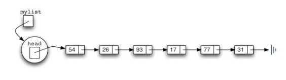

### 链表（```Linked List```）

###### 1、简单介绍

>链表(Linked list)是一种常见的基础数据结构，是一种线性表，但是并不会按线性的顺序存储数据，
而是在每一个节点里存储下一个节点的指针(Pointer)。—— 维基百科

链表的基本构造块是节点(Node，将在文章的第2部分通过Python实现一个简单的Node类)。
一个单向链表的构造如下图所示包含两个域：
- 信息域：当前节点的值(Data or Value)
- 指针域：指向下一个节点的指针链接(Reference or Link)


注1：必须明确指定链表的第一项的位置。一旦知道第一项在哪里，第一项可以告诉我们第二项是什么，依次类推。
按照一个方向遍历，直到最后一项（最后一个节点），最后一项需要知道没有下一项。
注2：这些节点在逻辑上是相连的，但要知道它们在物理内存上并不相连。

###### 2、准备工作

2.1 Node类

先来实现Node类：

```python
class Node(object):
    def __init__(self, initdata):
        self.data = initdata
        # 引用None代表没有下一节点
        self.next = None
    # 获得数据
    def getData(self):
        return self.data
    # 获得下一个节点的引用
    def getNext(self):
        return self.next
    # 修改数据
    def setData(self, newdata):
        self.data = newdata
    # 修改下一节点的引用
    def setNext(self, newnext):
        self.next = newnext
```

2.2 Unordered List类

只要知道第一个节点（包含第一个项），那么之后的每个节点都可以通过指向下一个节点的链接 依次找到。
考虑到这样的情况，Unordered List类只要维护对第一个节点的引用就可以了。
Unordered List类本身不包含任何节点对象，它只包含对链表结构中第一个节点的单个引用！

```python
class unOrderedList():
    def __init__(self):
        # 初始化None表示此时链表的头部不引用任何内容
        self.head = None
```

创建一个空的链表试试：

```python
myList = unOrderedList()
```


###### 3、基本操作的实现

添加元素后的链表如下图所示：



3.1 isEmpty()检查链表是否为空

```python
# 只有在链表中没有节点的时候为真
def isEmpty(self):
    return self.head is None
```

3.2 add()在链表前端添加元素

由于是在前端添加，因此最后添加的在最前端。

```python
def add(self, item):
    # Step0:创建一个新节点并将新项作为数据
    temp = Node(item)
    # Step1:更改新节点的下一个引用以引用旧链表的第一个节点
    temp.setNext(self.head)
    # Step2:重新设置链表的头以引用新节点
    self.head = temp
```

添加元素——执行mylist.add(26)时候的图解如下:

```python
mylist.add(31)
mylist.add(77)
mylist.add(17)
mylist.add(93)
mylist.add(26)
```


3.3 size()求链表长度

```python
def size(self):
    current = self.head
    count = 0
    while current:
        count += 1
        current = current.getNext()
    return count
```

通过current遍历链表并对节点计数。
图解如下:


3.4 search()查找

```python
def search(self, item):
    current = self.head
    found = False
    while current and not found:
        if current.getData() == item:
            found = True
        else:
            current = current.getNext()
    return found
```

通过current遍历链表，使用found标记是否找到了正在寻找的项。
图解如下:


3.5 remove()删除

```python
def remove(self, item):
    current = self.head
    previous = None
    found = False
    while not found:
        if current.getData() == item:
            found = True
        else:
            previous = current
            current = current.getNext()
    if previous is None:
        # 当要删除的项目恰好是链表中的第一个项，这时候prev是None，需要修改head以引用current之后的节点
        self.head = current.getNext()
    else:
        previous.setNext(current.getNext())
```

3.5.1 上面的特殊情况，即要删除的恰好是第一个节点的图解如下：


3.5.2 其他情况，即要删除的是链表中的节点（非第一个）：
遍历链表，先搜索，再删除。

1.搜索：
使用previous与current进行移动，借助found标记是否找到。
一旦found为True，current就是对包含要删除的项的节点的引用。

2.删除（修改引用）：
把previous的对下一节点的引用设为current的下一节点。

以上两过程的图解如下：


参考：
http://interactivepython.org/runestone/static/pythonds/index.html
https://en.wikipedia.org/wiki/Python

