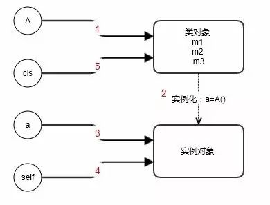

### ```@classmethod```与```@staticmethod```的区别

>参考文章：
- [@classmethod与@staticmethod的区别](http://mp.weixin.qq.com/s/j3VG28FaLWCoqxam3GIsDw)

Python面向对象编程中，类中定义的方法可以是```@classmethod```装饰的```类方法```，
也可以是```@staticmethod```装饰的```静态方法```，不过用的最多的还是不带装饰器的```实例方法```。
如果把这几个方法放一块，对初学者来说无疑是一头雾水，那该如何正确地使用它们呢？

先来看一个简单示例：

```python
class A(object):
    def m1(self, n):
        print("self:", self)

    @classmethod
    def m2(cls, n):
        print("cls:", cls)

    @staticmethod
    def m3(n):
        pass

a = A()
a.m1(1) # self: <__main__.A object at 0x02F046D0>
A.m2(1) # cls: <class '__main__.A'>
A.m3(1)
```

在类中一共定义了3个方法:
- m1是实例方法，第一个参数必须是 self（约定俗成的）。
- m2是类方法，第一个参数必须是cls（同样是约定俗成），
- m3是静态方法，参数根据业务需求定，可有可无。

当程序运行时，大概发生了这么几件事（结合下面的图来看）:



- 第一步：代码从第一行开始执行class 命令，此时会创建一个类A对象，同时初始化类里面的属性和方法，记住，此刻实例对象还没创建出来。
- 第二、三步：接着执行a=A()，系统自动调用类的构造器，构造出实例对象a。
- 第四步：接着调用a.m1(1) ，m1是实例方法，内部会自动把实例对象传递给self参数进行绑定，也就是说，self和a指向的都是同一个实例对象。
- 第五步：调用A.m2(1)时，python内部隐式地把类对象传递给cls参数，cls和A都指向类对象。

严格意义上来说，图中左边的都是变量名，是对象的引用，右边才是真正的对像，为了描述方便，
我直接把a称为对象，把A称为类对象，你应该明白我说对象其实是它所引用右边的那个真正的对象。
下面来看看每个方法各有什么特性。

###### 1、实例方法

```python
print(A.m1)
# A.m1在py2中显示为<unbound method A.m1>
<function A.m1 at 0x02CE5540>

print(a.m1)
<bound method A.m1 of <__main__.A object at 0x02C946D0>>
```

A.m1是一个还没有绑定实例对象的方法，对于未绑定方法，调用A.m1时必须显示地传入一个实例对象进去，
而a.m1是已经绑定了实例的方法，python隐式地把对象传递给了self参数，所以不再手动传递参数，这是调用实例方法的过程。

```python
A.m1(a, 1)
# 等价
a.m1(1)
```

如果未绑定的方法A.m1不传实例对象给self时，就会报参数缺失错误，
在 py3 与 py2 中，两者报的错误不一致，python2要求第一个参数self是实例对象，
而python3中可以是任意对象。

```python
A.m1(1)
TypeError: m1() missing 1 required positional argument: 'n'
```

###### 2、类方法

```python
print(A.m2)
<bound method A.m2 of <class '__main__.A'>>

print(a.m2)
<bound method A.m2 of <class '__main__.A'>>
```

m2是类方法，不管是A.m2 还是a.m2，都是已经自动绑定了类对象A的方法，对于后者，
因为python可以通过实例对象a找到它所属的类是A，找到A之后自动绑定到cls。

```python
 A.m2(1)
 # 等价
 a.m2(1)
```

这使得我们可以在实例方法中通过使用self.m2()这种方式来调用类方法和静态方法。

```python
def m1(self, n):
    print("self:", self)
    self.m2(n)
```

###### 3、静态方法

```python
print(A.m3)
<function A.m3 at 0x035854B0>

print(a.m3)
<function A.m3 at 0x035854B0>
```

m3是类里面的一个静态方法，跟普通函数没什么区别，与类和实例都没有所谓的绑定关系，
它只不过是碰巧存在类中的一个函数而已。不论是通过类还是实例都可以引用该方法。

```python
 A.m3(1)
 # 等价
 a.m3(1)
```

以上就是几个方法的基本介绍。现在把几个基本的概念理清楚了，那么现在来说说几个方法之间的使用场景以及他们之间的优缺点。

###### 4、静态方法的使用场景

如果在方法中不需要访问任何实例方法和属性，纯粹地通过传入参数并返回数据的功能性方法，
那么它就适合用静态方法来定义，它节省了实例化对象的开销成本，
往往这种方法放在类外面的模块层作为一个函数存在也是没问题的，而放在类中，
仅为这个类服务。

例如下面是微信公众号开发中验证微信签名的一个例子，它没有引用任何类或者实例相关的属性和方法。

```python
from hashlib import sha1
import tornado.web

class SignatureHandler(tornado.web.RequestHandler):
    def get(self):
        """
         根据签名判断请求是否来自微信
        """
        if self._check_sign(TOKEN, timestamp, nonce, signature):
            self.write(echostr)
        else:
            self.write("你不是微信发过来的请求")

    @staticmethod
    def _check_sign(token, timestamp, nonce, signature):
        sign = [token, timestamp, nonce]
        sign.sort()
        sign = "".join(sign)
        sign = sha1(sign).hexdigest()
        return sign == signature
```

###### 5、类方法的使用场景

作为工厂方法创建实例对象，例如内置模块datetime.date类中就有大量使用类方法
作为工厂方法，以此来创建date对象。

```python
class date:

    def __new__(cls, year, month=None, day=None):
        self = object.__new__(cls)
        self._year = year
        self._month = month
        self._day = day
        return self

    @classmethod
    def fromtimestamp(cls, t):
        y, m, d, * = _time.localtime(t)
        return cls(y, m, d)

    @classmethod
    def today(cls):
        t = _time.time()
        return cls.fromtimestamp(t)
```

如果希望在方法里面调用静态方法，那么把方法定义成类方法是合适的，因为要是定义成静态方法，那么你就要显示地引用类A，这对继承来说并不是一件好事情。

```python
class A:

    @staticmethod
    def m1()
        pass

    @staticmethod
    def m2():
        A.m1() # bad

    @classmethod
    def m3(cls):
        cls.m1() # good
```

