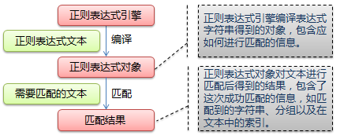

# Python正则表达式(```regular expression```)

正则表达式是一个特殊的字符序列，能帮助检查一个字符串是否与某种模式匹配。re模块使Python语言拥有全部的正则表达式功能。

re.compile函数根据一个模式字符串和可选的标志参数生成一个正则表达式对象，该对象拥有一系列方法用于正则表达式匹配和替换。
re模块也提供了与这些方法功能完全一致的函数，这些函数使用一个模式字符串做为它们的第一个参数。

###### 0、正则表达式基础
正则表达式匹配流程图：



正则表达式元字符和语法：


Python支持的正则表达式元字符和语法：[Python官方](https://translate.google.com.hk/translate?hl=zh-CN&sl=en&u=https://docs.python.org/2/library/re.html&prev=search)
或[博客园](https://www.cnblogs.com/huxi/archive/2010/07/04/1771073.html）


###### 1、re.compile函数
Python使用re.compile函数先将正则表达式的字符串形式编译为Pattern对象（即正则表达式对象），
然后使用Pattern对象处理文本并获得匹配结果（即Match对象），最后使用Match对象获得信息，进行其他的操作。

```python
import re

# 将正则表达式编译成Pattern对象
pattern = re.compile(r'hello')

# 使用Pattern匹配文本，获得匹配结果，无法匹配时将返回None
match = pattern.match('hello world!')

if match:
    # 使用Match获得分组信息
    print(match.group())

# 输出
hello
```

re.compile(pattern[, flags])，
该方法用于将字符串形式的正则表达式编译为Pattern对象。
第二个参数flag是匹配模式，取值可以使用按位或运算符'|'表示同时生效，比如re.I | re.M。
另外，也可以在正则表达式字符串中指定模式，比如re.compile('pattern', re.I | re.M)与re.compile('(?im)pattern')是等价的。
可选值有：
- I(re.IGNORECASE): 忽略大小写（括号内是完整写法，下同）
- M(MULTILINE): 多行模式，改变'^'和'$'的行为
- S(DOTALL): 点任意匹配模式，改变'.'的行为
- L(LOCALE): 使预定字符类 \w \W \b \B \s \S 取决于当前区域设定
- U(UNICODE): 使预定字符类 \w \W \b \B \s \S \d \D 取决于unicode定义的字符属性
- X(VERBOSE): 详细模式。这个模式下正则表达式可以是多行，忽略空白字符，并可以加入注释。以下两个正则表达式是等价的：
```python
a = re.compile(r"""\d +  # the integral part
                   \.    # the decimal point
                   \d *  # some fractional digits""", re.X)
b = re.compile(r"\d+\.\d*")
```

###### 2、Match对象
Match对象是一次匹配的结果，包含很多关于此次匹配的信息，可以使用Match对象提供的可读属性或方法来获取这些信息。

属性：
- string: 匹配时使用的文本。
- re: 匹配时使用的Pattern对象。
- pos: 文本中正则表达式开始搜索的索引。值与Pattern.match()和Pattern.seach()方法的同名参数相同。
- endpos: 文本中正则表达式结束搜索的索引。值与Pattern.match()和Pattern.seach()方法的同名参数相同。
- lastindex: 最后一个被捕获的分组在文本中的索引。如果没有被捕获的分组，将为None。
- lastgroup: 最后一个被捕获的分组的别名。如果这个分组没有别名或者没有被捕获的分组，将为None。

方法：
- group([group1, …]):
获得一个或多个分组截获的字符串；指定多个参数时将以元组形式返回。group1可以使用编号也可以使用别名；编号0代表整个匹配的子串；不填写参数时，返回group(0)；没有截获字符串的组返回None；截获了多次的组返回最后一次截获的子串。
- groups([default]):
以元组形式返回全部分组截获的字符串。相当于调用group(1,2,…last)。default表示没有截获字符串的组以这个值替代，默认为None。
- groupdict([default]):
返回以有别名的组的别名为键、以该组截获的字符串为值的字典，没有别名的组不包含在内。default含义同上。
- start([group]):
返回指定的组截获的子串在string中的起始索引（子串第一个字符的索引）。group默认值为0。
- end([group]):
返回指定的组截获的子串在string中的结束索引（子串最后一个字符的索引+1）。group默认值为0。
- span([group]):
返回(start(group), end(group))。
- expand(template):
将匹配到的分组代入template中然后返回。template中可以使用\id或\g<id>、\g<name>引用分组，但不能使用编号0。\id与\g<id>是等价的；但\10将被认为是第10个分组，如果你想表达\1之后是字符'0'，只能使用\g<1>0。

```python
import re
print("m.string:", m.string)
print("m.re:", m.re)
print("m.pos:", m.pos)
print("m.endpos:", m.endpos)
print("m.lastindex:", m.lastindex)
print("m.lastgroup:", m.lastgroup)

print("m.group(1,2):", m.group(1, 2))
print("m.groups():", m.groups())
print("m.groupdict():", m.groupdict())
print("m.start(2):", m.start(2))
print("m.end(2):", m.end(2))
print("m.span(2):", m.span(2))
print(r"m.expand(r'\2 \1\3'):", m.expand(r'\2 \1\3'))

### output ###
m.string: hello world!
m.re: re.compile('(\\w+) (\\w+)(?P<sign>.*)')
m.pos: 0
m.endpos: 12
m.lastindex: 3
m.lastgroup: sign
m.group(1,2): ('hello', 'world')
m.groups(): ('hello', 'world', '!')
m.groupdict(): {'sign': '!'}
m.start(2): 6
m.end(2): 11
m.span(2): (6, 11)
m.expand(r'\2 \1\3'): world hello!
```

###### 3、Pattern对象
Pattern对象是一个编译好的正则表达式，通过Pattern提供的一系列方法可以对文本进行匹配查找。
Pattern不能直接实例化，必须使用re.compile()进行构造。
Pattern提供了几个可读属性用于获取表达式的相关信息：
- pattern: 编译时用的表达式字符串。
- flags: 编译时用的匹配模式。数字形式。
- groups: 表达式中分组的数量。
- groupindex: 以表达式中有别名的组的别名为键、以该组对应的编号为值的字典，没有别名的组不包含在内。

```python
import re
p = re.compile(r'(\w+) (\w+)(?P<sign>.*)', re.DOTALL)

print("p.pattern:", p.pattern)
print("p.flags:", p.flags)
print("p.groups:", p.groups)
print("p.groupindex:", p.groupindex)

### output ###
# p.pattern: (\w+) (\w+)(?P<sign>.*)
# p.flags: 16
# p.groups: 3
# p.groupindex: {'sign': 3}
```

方法|re模块方法：
- match(string[, pos[, endpos]]) | re.match(pattern, string[, flags]):
这个方法将从string的pos下标处起尝试匹配pattern；如果pattern结束时仍可匹配，则返回一个Match对象；如果匹配过程中pattern无法匹配，或者匹配未结束就已到达endpos，则返回None。
pos和endpos的默认值分别为0和len(string)；re.match()无法指定这两个参数，参数flags用于编译pattern时指定匹配模式。
注意：这个方法并不是完全匹配。当pattern结束时若string还有剩余字符，仍然视为成功。想要完全匹配，可以在表达式末尾加上边界匹配符'$'。
- search(string[, pos[, endpos]]) | re.search(pattern, string[, flags]):
这个方法用于查找字符串中可以匹配成功的子串。从string的pos下标处起尝试匹配pattern，如果pattern结束时仍可匹配，则返回一个Match对象；若无法匹配，则将pos加1后重新尝试匹配；直到pos=endpos时仍无法匹配则返回None。
pos和endpos的默认值分别为0和len(string))；re.search()无法指定这两个参数，参数flags用于编译pattern时指定匹配模式。

```python
import re

# 将正则表达式编译成Pattern对象
pattern = re.compile(r'world')

# 使用search()查找匹配的子串，不存在能匹配的子串时将返回None
# 这个例子中使用match()无法成功匹配
match = pattern.search('hello world!')

if match:
    # 使用Match获得分组信息
    print match.group()

### 输出 ###
# world
```

- split(string[, maxsplit]) | re.split(pattern, string[, maxsplit]):
按照能够匹配的子串将string分割后返回列表。maxsplit用于指定最大分割次数，不指定将全部分割。

```python
import re

p = re.compile(r'\d+')
print p.split('one1two2three3four4')

### output ###
# ['one', 'two', 'three', 'four', '']
```

- findall(string[, pos[, endpos]]) | re.findall(pattern, string[, flags]):
搜索string，以列表形式返回全部能匹配的子串。

```python
import re

p = re.compile(r'\d+')
print p.findall('one1two2three3four4')

### output ###
# ['1', '2', '3', '4']
```

- finditer(string[, pos[, endpos]]) | re.finditer(pattern, string[, flags]):
搜索string，返回一个顺序访问每一个匹配结果（Match对象）的迭代器。

```python
import re

p = re.compile(r'\d+')
for m in p.finditer('one1two2three3four4'):
    print m.group(),

### output ###
# 1 2 3 4
```

- sub(repl, string[, count]) | re.sub(pattern, repl, string[, count]):
使用repl替换string中每一个匹配的子串后返回替换后的字符串。
当repl是一个字符串时，可以使用\id或\g<id>、\g<name>引用分组，但不能使用编号0。
当repl是一个方法时，这个方法应当只接受一个参数（Match对象），并返回一个字符串用于替换（返回的字符串中不能再引用分组）。
count用于指定最多替换次数，不指定时全部替换。

```python
import re

p = re.compile(r'(\w+) (\w+)')
s = 'i say, hello world!'
print(p.sub(r'\2 \1', s))

def func(m):
    return m.group(1).title() + ' ' + m.group(2).title()

print(p.sub(func, s))

### output ###
# say i, world hello!
# I Say, Hello World!
```

- subn(repl, string[, count]) |re.sub(pattern, repl, string[, count]):
返回 (sub(repl, string[, count]), 替换次数)。

```python
import re

p = re.compile(r'(\w+) (\w+)')
s = 'i say, hello world!'
print(p.subn(r'\2 \1', s))

def func(m):
    return m.group(1).title() + ' ' + m.group(2).title()

print(p.subn(func, s))

### output ###
# ('say i, world hello!', 2)
# ('I Say, Hello World!', 2)
```


